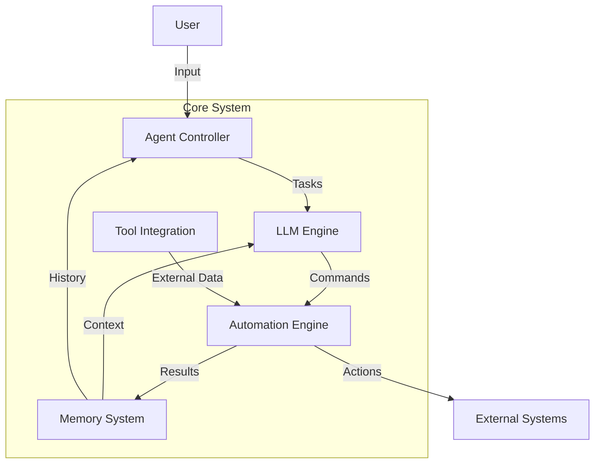
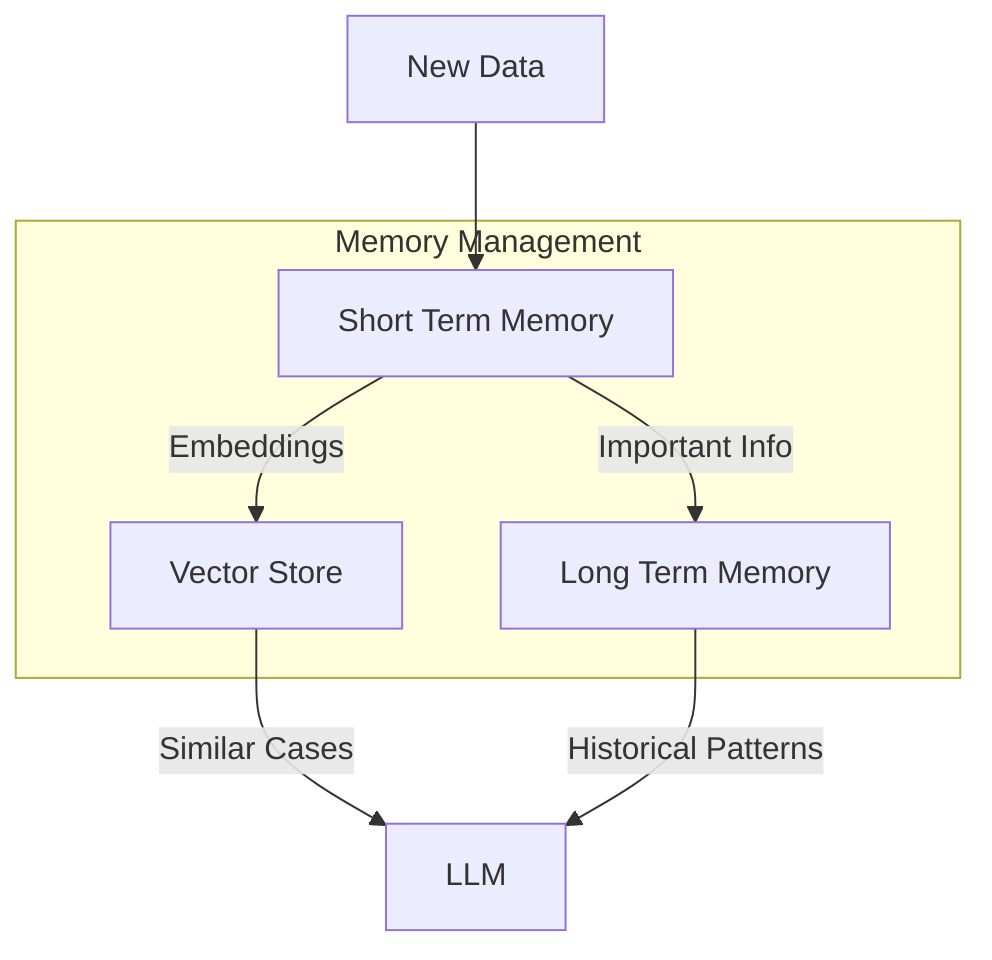
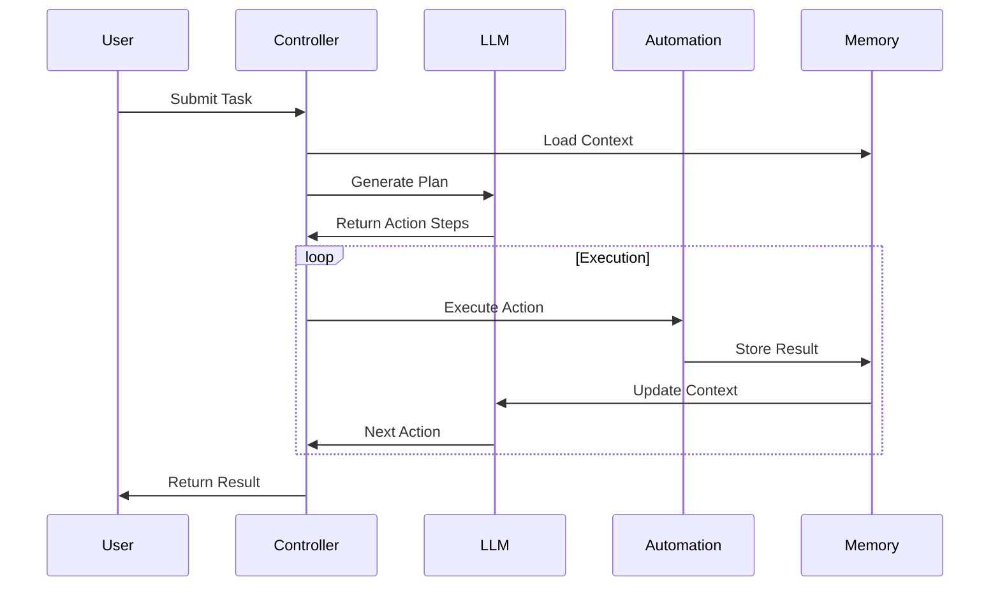
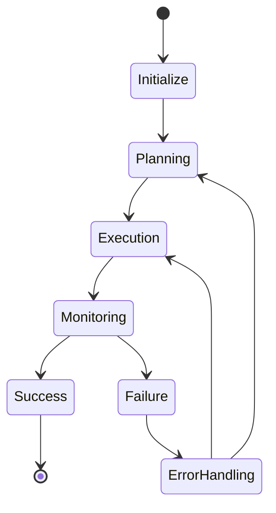
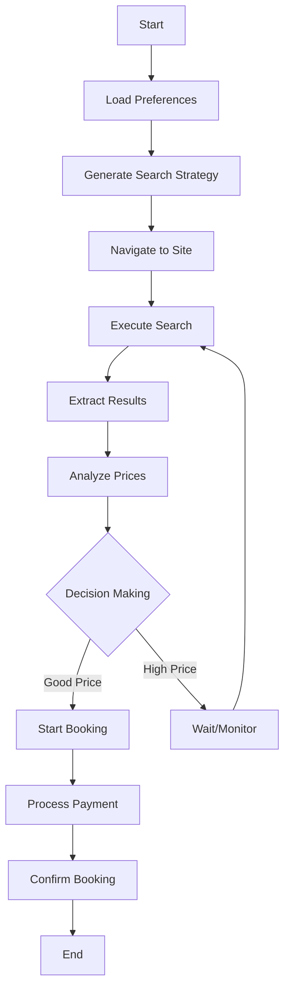

# Task Automation Agent

An intelligent agent framework for automating complex web-based tasks using LLMs and modern automation tools.

## Overview

This project implements a modular, extensible automation framework that combines Large Language Models (LLMs) with web automation tools to create intelligent agents capable of handling complex tasks autonomously.

## Architecture

### Core System Architecture

## Tech Stack

- **Base LLM**: Mistral-7b or Llama2
- **Framework**: LangChain or AutoGPT
- **Browser Automation**: Playwright/Selenium
- **Vector DB**: ChromaDB

## Core Components

### 1. Agent Controller

- Central orchestrator managing workflow
- Handles task parsing and goal setting
- Manages component coordination
- Implements error handling and recovery
- Maintains state management
- Monitors execution

### 2. LLM Engine

Decision making and reasoning core with components:

- **Task Planning Module**
  - Breaks down high-level tasks
  - Generates execution plans
- **Decision Engine**
  - Evaluates scenarios
  - Handles uncertainty
- **Response Parser**
  - Structures outputs
  - Validates responses

### 3. Automation Engine

Handles system interactions through:

- **Browser Controller**
  - Web session management
  - Dynamic content handling
  - Retry mechanisms
- **Element Interaction Manager**
  - Selector management
  - UI change handling
- **Data Extractor**
  - Information scraping
  - Data validation

### 4. Memory System

Maintains context through:

## Execution Flow

### Component Interaction

### State Management

## Example Use Case: Flight Booking

### Task Flow:

1. **Initialization**

   - Parse requirements
   - Load past experiences
   - Generate search strategy

2. **Planning**

   - Site navigation
   - Search execution
   - Result analysis
   - Price comparison
   - Booking process

3. **Execution**
   - Navigate site
   - Input criteria
   - Analyze results
   - Make decisions
   - Handle payment

## Getting Started

[Coming Soon]

## Contributing

[Coming Soon]

## License

[Coming Soon]
